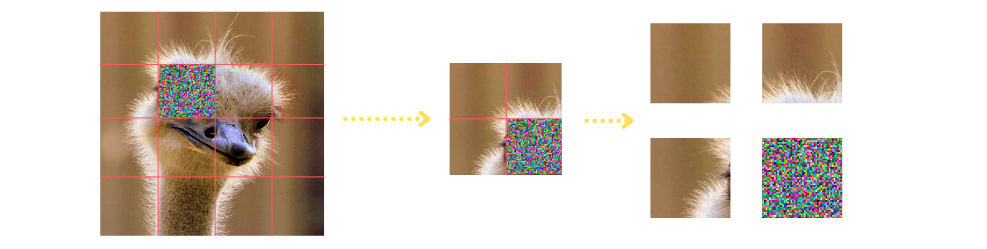

# Introduction

This repository contains the code and experiments conducted for my bachelor thesis on **Adversarial Attacks Against Vision Transformers**. It includes two main components:

1. **CleverHans Experiments** - evaluation of standard adversarial attack methods on multiple models. 
2. **Random Position Patch Experiments** - implementation of the paper ["Designing Physical-World Universal Attacks on Vision Transformers"](https://openreview.net/forum?id=DqBPk7887N), as well as our novel **Mini-Patch Attacks**.

All experiments use the [ImageNetV2](https://github.com/modestyachts/ImageNetV2) dataset, which contains 1000 classes with 10 images each. 


Instructions on how to use each component are detailed below.

---


# CleverHans Experiments

This module evaluates the robustness of modern vision models against common white-box adversarial attacks using the **CleverHans** library. Attacks are applied to ImageNetV2 images, and the results can be optionally logged using **Weights & Biases** (W&B). 

### Attack methods used in this framework
- Fast Gradient Sign Method (FGSM);
- Projected Gradient Descent (PGD).

### Evaluated models
- ResNet50 and ResNet152 from the CNN family;
- ViT-B/16 and ViT-L/32 from the ViT family.

### Attack types
- Untargeted Attack:
  The model is fooled into predicting *any class* other than the true label.  
  No additional parameters are needed.
  
- Targeted Attack:
  The model is forced to classify the image as a *specific target class*.  
  The user must supply a numerical label for the target class using the `--target` argument.


### Running The Experiments
To run experiments in this framework, move to the `CleverHans` directory and run:

`python main.py --image_folder_path <path to image dataset> --attack <attack name> --model <victim model> --target <target class> --epsilon <perturbation magnitude>`

#### Parameters:

- `--image_folder_path`: path to the ImageNetV2 dataset
- `--attack`: attack type (`FGSM` or `PGD`)
- `--model`: model name (`resnet50`, `resnet152`, `vit_b_16`, or `vit_l_32`)
- `--epsilon`: perturbation magnitude
- `--target`: *(optional)* target class for targeted attack
- `--wandb_entity`: *(optional)* W&B entity for logging

For untargeted attacks, simply omit the `--target` argument. 

#### Example Commands:

- Untargeted FGSM on ViT-B/16:
```bash
python main.py \
  --image_folder_path '../imagenetv2-top-images/imagenet-imagenetv2-top-images-format-val' \
  --attack FGSM \
  --model vit_b_16 \
  --epsilon 0.05
```

- Targeted (class "Bee", with a numerical label 309) PGD on ResNet152, with a higher perturbation magnitude
```bash
python main.py \
  --image_folder_path '../imagenetv2-top-images/imagenet-imagenetv2-top-images-format-val' \
  --attack PGD \
  --model resnet152 \
  --target 309 \
  --epsilon 0.2
```


### Outputs

Results of the experiments are simply printed out to the standard output with:
- Per-batch success rates
- Final succes rate over the entire dataset

To enable W&B logging for better visualization, ensure:
- you have a `.env` file outside the `CleverHans` directory containing:
```
WANDB_API_KEY=your_api_key_here
```
- and you use the optional `--wandb_entity` argument when running the experiments.


~ Note, that ImageNetV2 dataset is not included in the repository due to storage limits. The script expects it to be in the same directory as `CleverHans` by default.


---

# Random Position Patch Experiments

This module implements several patch-based adversarial attacks. We differentiate between **G-Patch** (proposed in the paper ["Designing Physical-World Universal Attacks on Vision Transformers"](https://openreview.net/forum?id=DqBPk7887N)) and **Mini-Patch** attacks.

In both settings, we essentially leverage a GAN-like architecture, where we train a **Generator** that crafts adversarial patches, which is then followed by a **Deployer** that simulates random placement of patches.

Generator training is same for both settings, with the only difference in patch sizes. Deployment, on the other hand, is a bit different. We explore these in details below.

## G-Patch Attacks

In this setting, a single universal patch is trained and applied to all images in a batch — but at different random positions per image. The patch is optimized to generalize across locations and samples.

### Patch Sizes
- `64×64` patches, that cover about 8% of the original image
- `80×80` patches, that cover about 13% of the original image.

### Deployment

Deployer completely randomizes patch deployment for every input image in the dataset. It essentially replaces a specific region of image with the adversarial patch.


--


## Mini-Patch Attacks

In this setting, we train a generator that creates much smaller patches, that are deployed at **several** points in the input image. Note, that the patches are the same across the image, which maintains consistency.

We further differentiate between 3 types of Mini-Patch attacks:

- **Random Placement Patches**: here, we imitate G-Patch implementation, only instead of a single large patch we deploy a much smaller patch at several **random** places.
- **Corner-Point Patches**: in this setting patches are centered at "intersection points" aligned with the internal tokenization of Vision Transformers.
- **Token-Replacement Patches**: here we place the patches *within* the tokens of ViTs, essentially replacing them.

In each setting, we have:
- `16×16` patches, which are the main focus of our experiments. These patches are deployed at **8** different places in the image.
- `32×32` patches, which are used for ViT models that use the same dimensions for image tokenization. These patches are deployed at **4** different places in the input image.

Overall, for both patch sizes, adversarial regions are about 8% of the original image, i.e. same coverage as of 64×64 G-Patch. The placement and how the patches affect tokens of ViT models are illustrated in the figures below:





## Evaluated Models

In both, G-Patch and Mini-Patch configurations, we evaluate our generators against:

- ViT-B/16, ViT-B/32, ViT-L/16 and Swin-B from the ViT family;
- ResNet50, ResNet152 and VGG16-BN from the CNN family (these are omitted in **Token-Replacement Patch** setting)


## Running The Experiments

To run the experiments, move to the `Random_Position_Patch` directory.


### Parameters:

- `--image_folder_path`: path to the ImageNetV2 dataset
- `--run_mode`: experiment mode - training(`train`) or testing(`test`)
- `--attack_mode`: attack type 
    For G-Patch: `gpatch`
    For Mini-Patches: *Random Placement* - `mini_0`;
                      *Corner-Point* `mini_1`;
                      *Token-Replacement* `mini_2`.
- `--training_models`: list of training model names (in testing experiments, list of source models)
    Possible values:`resnet50`, `resnet152`, `vgg16_bn`, `vit_b_16`, `vit_b_32`, `vit_l_16`, `swin_b`
- `--test_models`: list of target model names, necessary only in testing experiments
- `--target_class`: target class for the generator train on
- `--patch_size`: patch size for the generator
    For G-patches: `64`, `80`
    For Mini-Patches: `16`, `32`
- `--num_of_patches`: number of patches to be deployed on input images
    For G-patches: `1`
    For Mini-Patches: `4`, `8`, depending on the patch size
- `--epochs` *(optional)* number of epochs for training, by default 40
- `--num_of_train_classes`: *(optional)* number of training classes to load from the dataset, by default 1000
- `--wandb_entity`: *(optional)* WANDB entity for logging


We provide example commands for different configurations of our experiments:

**Training a G-Patch generator against ViT-B/16**
```bash
python main.py \
  --image_folder_path '../imagenetv2-top-images/imagenet-imagenetv2-top-images-format-val' \
  --run_mode train \
  --attack_mode gpatch \
  --training_models vit_b_16 \
  --target_class 153 \
  --patch_size 80 \
  --num_of_patches 1
```


**Training a Corner-Point patch generator against ensemble of models**
```bash
python main.py \
  --image_folder_path '../imagenetv2-top-images/imagenet-imagenetv2-top-images-format-val' \
  --run_mode train \
  --attack_mode mini_1 \
  --training_models vit_b_16 vit_l_16 swin_b \
  --target_class 153 \
  --patch_size 16 \
  --num_of_patches 8
```


**Testing the generators trained using ResNet50, on ResNet152**
```bash
python main.py \
  --image_folder_path '../imagenetv2-top-images/imagenet-imagenetv2-top-images-format-val' \
  --run_mode test \
  --attack_mode gpatch \
  --training_models resnet50 \
  --test_models resnet152 \
  --target_class 153 \
  --patch_size 64 \
  --num_of_patches 1
```


