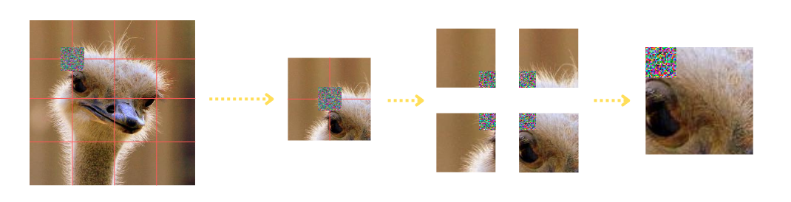

# Introduction

This repository contains the code and experiments conducted for my bachelor thesis on **Adversarial Attacks Against Vision Transformers**. It includes two main components:

1. **CleverHans Experiments** - evaluation of standard adversarial attack methods on multiple models. 
2. **Random Position Patch Experiments** - implementation of the paper ["Designing Physical-World Universal Attacks on Vision Transformers"](https://openreview.net/forum?id=DqBPk7887N), as well as our novel **Mini-Patch Attacks**.

All experiments use the [ImageNetV2](https://github.com/modestyachts/ImageNetV2) dataset, which contains 1000 classes with 10 images each. 


Instructions on how to use each component are detailed below.

---


# CleverHans Experiments

This module evaluates the robustness of modern vision models against common white-box adversarial attacks using the **CleverHans** library. Attacks are applied to ImageNetV2 images, and the results can be optionally logged using **Weights & Biases** (W&B). 

### Attack methods used in this framework
- Fast Gradient Sign Method (FGSM);
- Projected Gradient Descent (PGD).

### Evaluated models
- ResNet50 and ResNet152 from the CNN family;
- ViT-B/16 and ViT-L/32 from the ViT family.

### Attack types
- Untargeted Attack:
  The model is fooled into predicting *any class* other than the true label.  
  No additional parameters are needed.
  
- Targeted Attack:
  The model is forced to classify the image as a *specific target class*.  
  The user must supply a numerical label for the target class using the `--target` argument.


### Running The Experiments
To run experiments in this framework, make sure you are in the root, `Thesis` directory and run:

`python -m CleverHans.main --image_folder_path <path to image dataset> --attack <attack name> --model <victim model> --target <target class> --epsilon <perturbation magnitude>`

#### Parameters:

- `--image_folder_path`: path to the ImageNetV2 dataset
- `--attack`: attack type (`FGSM` or `PGD`)
- `--model`: model name (`resnet50`, `resnet152`, `vit_b_16`, or `vit_l_32`)
- `--epsilon`: perturbation magnitude
- `--target`: *(optional)* target class for targeted attack
- `--wandb_entity`: *(optional)* W&B entity for logging

For untargeted attacks, simply omit the `--target` argument. 

#### Example Commands:

- Untargeted FGSM on ViT-B/16:
```bash
python main.py \
  --image_folder_path '../imagenetv2-top-images/imagenet-imagenetv2-top-images-format-val' \
  --attack FGSM \
  --model vit_b_16 \
  --epsilon 0.05
```

- Targeted (class "Bee", with a numerical label 309) PGD on ResNet152, with a higher perturbation magnitude
```bash
python main.py \
  --image_folder_path '../imagenetv2-top-images/imagenet-imagenetv2-top-images-format-val' \
  --attack PGD \
  --model resnet152 \
  --target 309 \
  --epsilon 0.2
```


### Outputs

Results of the experiments are simply printed out to the standard output with:
- Per-batch success rates
- Final succes rate over the entire dataset

To enable W&B logging for better visualization, ensure:
- you have a `.env` file outside the `CleverHans` directory containing:
```
WANDB_API_KEY=your_api_key_here
```
- and you use the optional `--wandb_entity` argument when running the experiments.


### Developer Documentation


For more detailed documentation of the source code, please, open `CleverHans/docs/build/html/index.html` in your browser.   


---

# Random Position Patch Experiments

This module implements several patch-based adversarial attacks. The two main types of attacks we explore are **G-Patch** (proposed in the paper ["Designing Physical-World Universal Attacks on Vision Transformers"](https://openreview.net/forum?id=DqBPk7887N)) and **Mini-Patch** attacks.

In both attack types, we essentially leverage a GAN-like architecture, where we train a **Generator** that crafts adversarial patches, and then a **Deployer** applies the patches at random positions within the images.

The Generator training is similar for both settings, with the primary difference in patch sizes. The Deployment, on the other hand, is a bit different. We explore these in detail below.

## G-Patch Attacks

In this attack type, a single universal patch is trained and applied to all images in a batch, but each image receives the patch at a different random location.

### Patch Sizes
- `64×64` patches, that cover about 8% of the original image;
- `80×80` patches, that cover about 13% of the original image.

### Deployment

The Deployer completely randomizes patch deployment for every input image in the dataset. It essentially replaces a specific region of the image with the adversarial patch.


## Mini-Patch Attacks

In Mini-Patch attacks, we train a generator that creates much smaller patches, which are then deployed at **several** points in the input image. Note, that the patches are the same across the image.

We further differentiate between 3 types of Mini-Patch attacks:

- **Random Placement Patches**: here, we imitate G-Patch implementation, only instead of a single large patch, we deploy a much smaller patch at several **random** places.

- **Corner-Point Patches**: in this setting patches are centered at "intersection points" aligned with the internal tokenization of Vision Transformers. This is illustrated in the figure below:

Adversarial patch of size 32×32 centered at a corner point of the image (red lines do not represent the exact tokenization of ViT models, for the sake of better visualization, tokens here are of size 56×56). This results in attacking 4 tokens with 8×8 size adversarial patches

- **Token-Replacement Patches**: here we place the patches *within* the tokens of ViTs, essentially replacing them. This is illustrated in the figure below:


Adversarial patch is placed entirely inside the token. For the sake of better visualization, tokens here are of size 56×56(and so is the example adversarial patch). This results in replacing 1 token entirely.


### Patch Sizes
- `16×16` patches, which are the main focus of our experiments. These patches are deployed at **8** different places in the image.
- `32×32` patches, which are used for ViT models that use the same dimensions for image tokenization. These patches are deployed at **4** different places in the input image.

For both patch sizes, the adversarial patches cover around 8% of the original image, which is similar to the coverage of a 64×64 G-Patch.


## Evaluated Models

In both, G-Patch and Mini-Patch experiments, we evaluate our generators using the following models:

- ViT-B/16, ViT-B/32, ViT-L/16 and Swin-B from the ViT family;
- ResNet50, ResNet152 and VGG16-BN from the CNN family (Note: CNN models are excluded from the **Token-Replacement** Patch attack).


## Running The Experiments

To run the experiments, navigate to the root (`Thesis`) directory and run:
```bash
python -m Random_Position_Patch.main \
  --image_folder_path <path to image dataset> \
  --checkpoint_folder_path <path to checkpoint dir> \
  --run_mode <experiment mode> \
  --attack_mode <attack type> \
  --training_models <list of training models> \
  --test_models <list of target models> \  (only when testing)
  --target_class <target class> \
  --patch_size <patch size> \
  --num_of_patches <number of patches to deploy> \
  --local_generator <path to the pre-trained generator> (only when testing)
```


### Parameters:

- `--image_folder_path`: path to the ImageNetV2 dataset.
- `--checkpoint_folder_path`: path to a folder where generators from each epoch will be saved. By default `./Random_Position_Patch/checkpoints`.
- `--run_mode`: experiment mode, either raining(`train`) or testing(`test`).
- `--attack_mode`: the type of attack: 
    For G-Patch: `gpatch`;
    For Mini-Patches: *Random Placement* - `mini_0`;
                      *Corner-Point* `mini_1`;
                      *Token-Replacement* `mini_2`.
- `--training_models`: list of training model names (in testing experiments, list of source models).
    Possible values:`resnet50`, `resnet152`, `vgg16_bn`, `vit_b_16`, `vit_b_32`, `vit_l_16`, `swin_b`.
- `--test_models`: list of target model names, necessary only in testing experiments.
- `--target_class`: target class for the generator train on.
- `--patch_size`: patch size for the generator:
    For G-patches: `64`, `80`;
    For Mini-Patches: `16`, `32`.
- `--num_of_patches`: number of patches to be deployed on input images.
    For G-patches: `1`;
    For Mini-Patches: `4`, `8`, depending on the patch size.
- `--epochs`: number of epochs for training. By default 40.
- `--wandb_entity`: *(optional)* W&B entity for logging. In the test mode, generators are downloaded from W&B.
- `--local_generator` : *(optional)* path to the locally saved pre-trained generators, for the test mode. 


### Example Commands

**Training a G-Patch generator against ViT-B/16**
```bash
python -m Random_Position_Patch.main \
  --image_folder_path './imagenetv2-top-images/imagenet-imagenetv2-top-images-format-val' \
  --run_mode train \
  --attack_mode gpatch \
  --training_models vit_b_16 \
  --target_class 153 \
  --patch_size 80 \
  --num_of_patches 1 \
```


**Training a Corner-Point patch generator against an ensemble of models**
```bash
python -m Random_Position_Patch.main \
  --image_folder_path './imagenetv2-top-images/imagenet-imagenetv2-top-images-format-val' \
  --run_mode train \
  --attack_mode mini_1 \
  --training_models vit_b_16 vit_l_16 swin_b \
  --target_class 153 \
  --patch_size 16 \
  --num_of_patches 8
```


**Testing the generators trained using ResNet50, on ResNet152**
```bash
python -m Random_Position_Patch.main \
  --image_folder_path '../imagenetv2-top-images/imagenet-imagenetv2-top-images-format-val' \
  --run_mode test \
  --attack_mode gpatch \
  --training_models resnet50 \
  --test_models resnet152 \
  --target_class 153 \
  --patch_size 64 \
  --num_of_patches 1 \
  --wandb_entity <wandb_entity>
```
~ Note that here we don't specify path to the generator, therefore we need to provide W&B entity argument. The script will try to find the training project (corresponding to the provided source models) and download the generators from there.

If you want to load locally saved generators:

**Testing Mini-Patch generators trained using Swin-B, on ViT-B/16**
```bash
python -m Random_Position_Patch.main \
  --image_folder_path '../imagenetv2-top-images/imagenet-imagenetv2-top-images-format-val' \
  --run_mode test \
  --attack_mode mini_1 \
  --training_models swin_b \
  --test_models vit_b_16 \
  --target_class 746 \
  --patch_size 16 \
  --num_of_patches 8 \
  --local_generator './Generators/mini1_swinb_746.pth'
```

* We note here that 4 different pre-trained generators are provided in the `Thesis/Generators` directory.

## Outputs

Detailed results of the experiments are printed out to the standard output with the following metricsL

- **Training:**
  - Per-batch success rates
  - Per-epoch success rates
  - Final succes rate over the entire dataset

- **Evaluation**
  - Evaluation results for each generator on 5 random noise vectors

For more detailed logging, enable W&B logging to visualize the training process for each epoch, track the evolution of ASRs and loss, and log modified images and adversarial patches.

Ensure:
- you have a `.env` file outside the `CleverHans` directory containing:
```
WANDB_API_KEY=your_api_key_here
```
- and you use the optional `--wandb_entity` argument when running the experiments.


## Developer Documentation


For more detailed documentation of the source code, please, open `Random_Position_Patch/docs/build/html/index.html` in your browser.


~ Note, that ImageNetV2 dataset is not included in the repository due to storage limits. The script expects it to be in the same directory as `CleverHans` by default (i.e. root directory).
